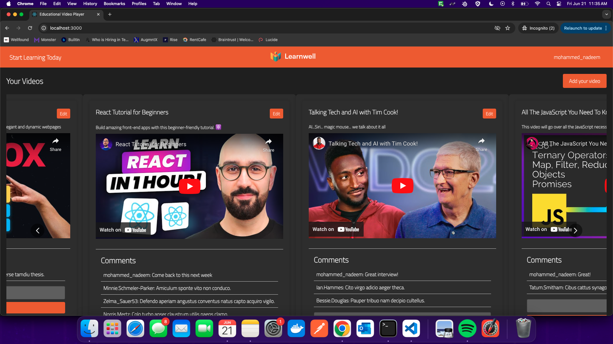
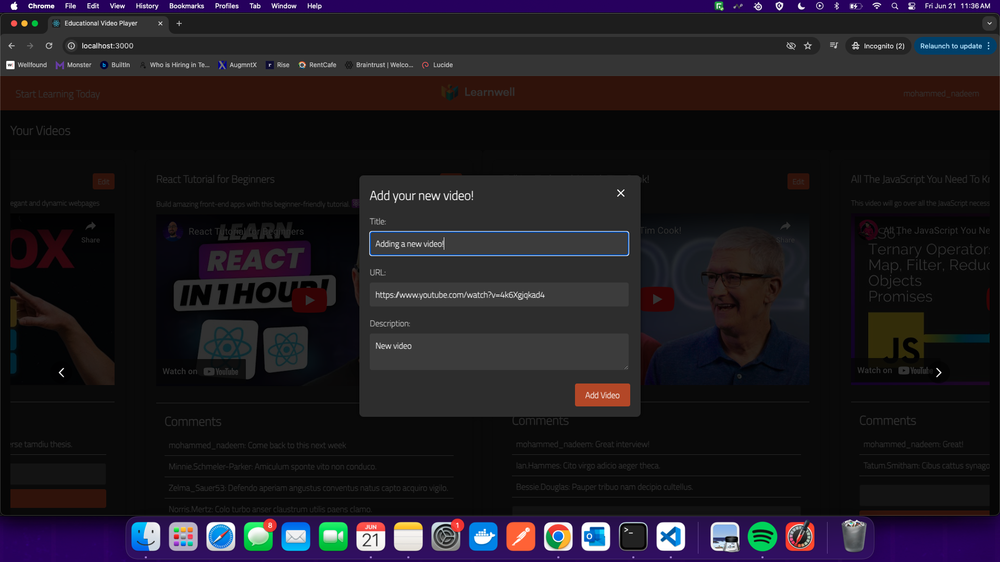
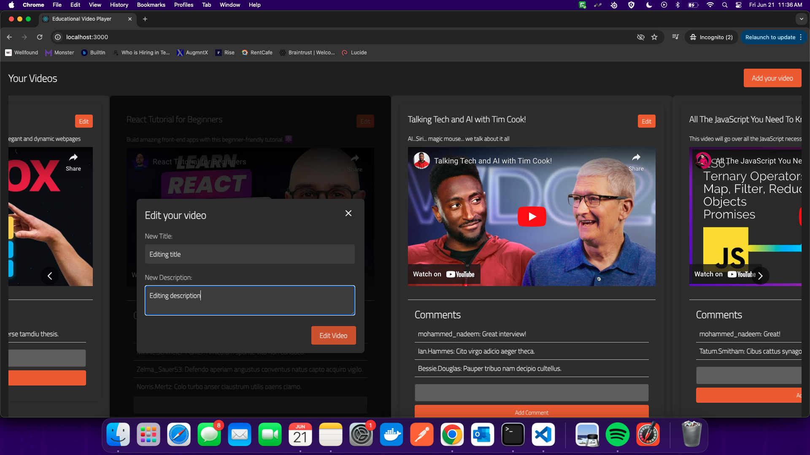
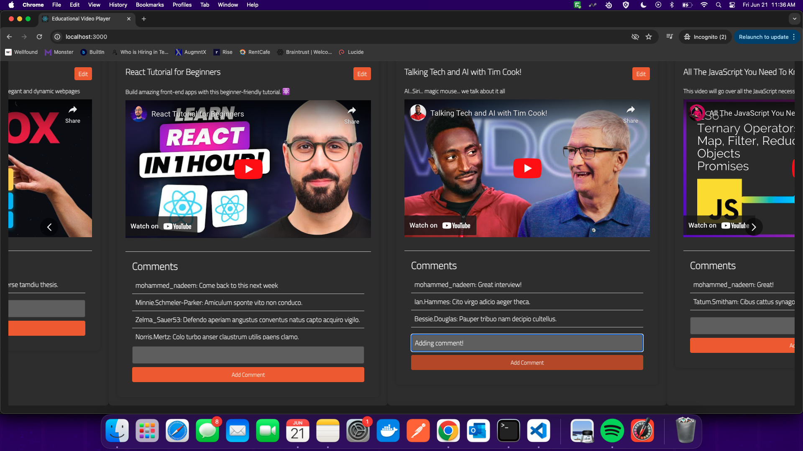
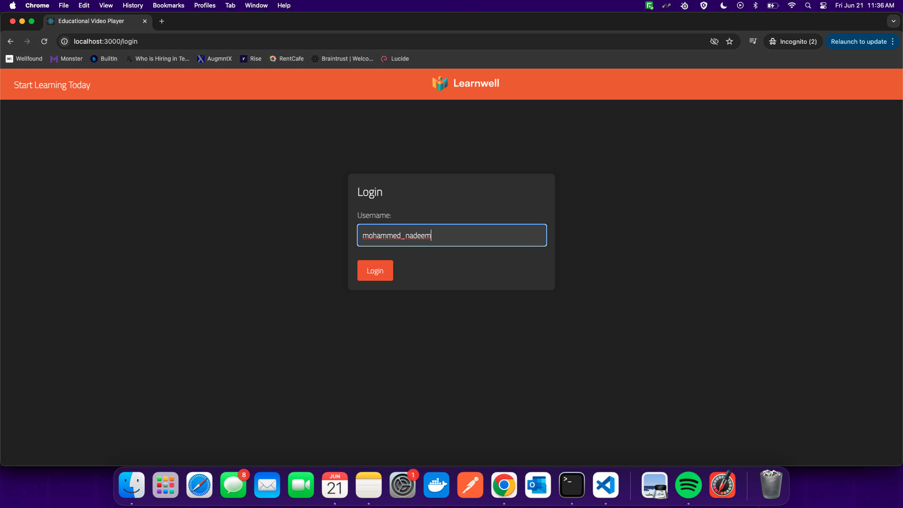
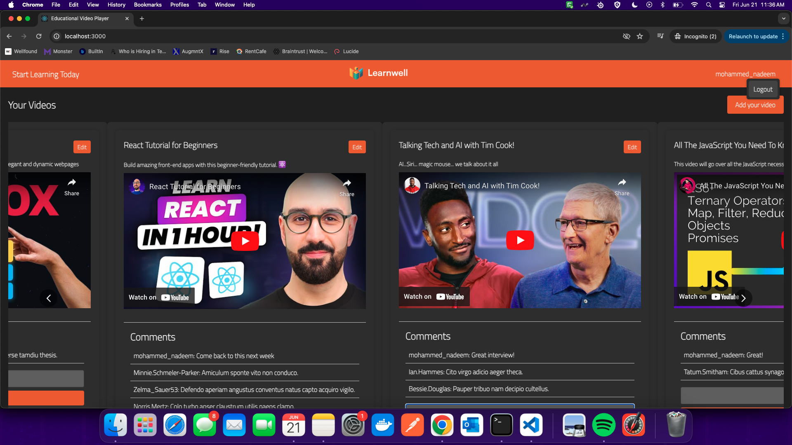

# Video Sharing Platform

This project is a video sharing platform where users can upload, view, edit, and comment on videos. The frontend is built using React, and it includes various components such as a navigation bar, video list, modals for creating and editing videos, and a comment section. This README file explains the setup, development process, and key features of the application. 

In order to see the full functionality of the application, please login with a new user, and add 4-6 videos to be able to see all the features implemented and the actual design layout. Thank you!

## Table of Contents
- [Features](#features)
- [Installation](#installation)
- [Usage](#usage)
- [Component Details](#component-details)
  - [NavBar](#navbar)
  - [VideoList](#videolist)
  - [CreateModal](#createmodal)
  - [EditModal](#editmodal)
  - [CommentSection](#commentsection)
  - [Login](#login)
- [Styling](#styling)
- [Screenshots](#screenshots)
- [Contributing](#contributing)

## Features
- User login and logout.
- Video upload and edit functionalities.
- Responsive video list with a carousel view.
- Modal components for creating and editing videos.
- Full playback functionality for videos, with all controls
- Comment section with persistent fake and real comments.
- Dark theme styling for the user interface.

## Installation
To run this project locally, follow these steps:

1. **Clone the repository**:
    ```bash
    git clone https://github.com/rajaabnadeem/video_player.git
    cd video-sharing-platform
    ```

2. **Install dependencies**:
    ```bash
    npm install
    ```

3. **Run the development server**:
    ```bash
    npm start
    ```

## Usage
1. **Login/Register**: Users can log in with their credentials. If they are using the platform for the first time, they can simply enter their desired username to sign up. Unforunately, this application is currently only handling login on the client-side, due to limitations with the API endpoints available as well as database. This will be refactored in the future to handle proper login and signup authentication with usernames and passwords, as currently we are only logging in with any username.
2. **Upload Videos**: Users can upload new videos using the "Add your video" button.
3. **Edit Videos**: Users can edit their videos by clicking the "Edit" button next to the video title.
4. **View Videos**: Videos are displayed in a carousel, and users can play them directly.
5. **Comment on Videos**: Users can add comments to videos, which are displayed in the comment section.

## Component Details

### NavBar
The `NavBar` component includes the site navigation with the user's name and a logo centered in the middle.

- **CSS file**: `styles/css/NavBar.css`
- **Key points**:
  - Centered logo
  - User name aligned to the right

### VideoList
The `VideoList` component displays a list of videos in a responsive carousel. It includes functionalities for adding and editing videos.

- **CSS file**: `styles/css/VideoList.css`
- **Key points**:
  - Responsive carousel for video display
  - Edit button inline with video titles
  - Integrated `CreateModal`, `EditModal`, and `CommentSection`

### CreateModal
The `CreateModal` component provides a form for users to add new videos.

- **CSS file**: `styles/css/Modal.css`
- **Key points**:
  - Allows user to enter a new video title, URL, and description. Upon clicking "Add Video", this will be added to their current video library with all the requisite information provided.
  - Dark-themed modal
  - Full-screen modal on open

### EditModal
The `EditModal` component allows users to edit existing videos.

- **CSS file**: `styles/css/Modal.css`
- **Key points**:
  - Allows user to edit their video title and description. Upon clicking the "Edit Video" button, the new title and description will be displayed
  - Dark-themed modal

### CommentSection
The `CommentSection` component displays and allows adding comments on videos. It handles both fake and real comments, ensuring persistence across reloads.

- **CSS file**: `styles/css/CommentSection.css`
- **Key points**:
  - Utilizes the @faker-js package to generate fake comments if none exist
  - Combines fake and real comments
  - Persistent storage of comments using local storage

### Login
The `Login` component allows users to log in or register. It handles user authentication and integrates with the AuthContext for managing user sessions.

- **CSS file**: `styles/css/Login.css`
- **Key points**:
  - Dark-themed login form
  - White input fields and orange submit button
  - Error handling and validation

## Styling
The application follows a dark theme with consistent styling across all components. Key CSS files are located in the `styles/css` directory.

- **NavBar**: `styles/css/NavBar.css`
- **VideoList**: `styles/css/VideoList.css`
- **Modal (Create and Edit)**: `styles/css/Modal.css`
- **CommentSection**: `styles/css/CommentSection.css`
- **Login**: `styles/css/Login.css`


## Screenshots
Add screenshots of the application here to visually represent each component and feature.

1. **NavBar & VideoList**:
   

2. **CreateModal**:
   

3. **EditModal**:
   

4. **CommentSection**:
   

4. **Login**:
   

4. **Logout**:
   

## Contributing
Contributions are welcome! Please fork the repository and create a pull request with your changes. Ensure your code follows the existing code style and includes appropriate tests.

1. Fork the repository.
2. Create a new branch: `git checkout -b feature-branch-name`.
3. Make your changes and commit them: `git commit -m 'Add new feature'`.
4. Push to the branch: `git push origin feature-branch-name`.
5. Submit a pull request.


## Video Walkthrough
Here's a Loom link to a video walkthrough/demo of the application
https://www.loom.com/share/c3c1129113274883b77f598e478a6485